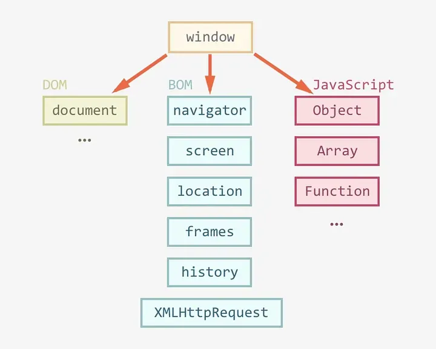

### Window Object
The Window object is a global object in client-side ***JavaScript***, representing the browser window containing a DOM document and acting as the root of the document object model.

The window object, supported by all browsers, represents the browser’s window and automatically includes global JavaScript objects, functions, and variables as members.

The Window object is responsible for managing global variables, functions, and objects, providing methods for browser interaction and managing properties related to frames, tabs, or windows, such as alert(), confirm(), setTimeout(), and setInterval().

Some of the Javascript 

>window.document.URL; - Open a new URL

>window.open() - Open a new window

>window.close() - Close the current window

>window.moveTo() - Move the current window

>window.resizeTo() - Resize the current window